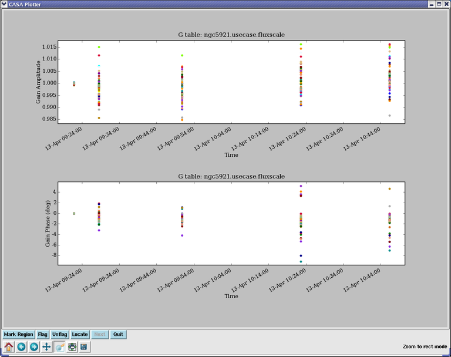

Examples
========

.. container:: documentDescription description

   task examples

.. container:: section
   :name: content-core

   .. container::
      :name: parent-fieldname-text

      To plot amplitude and phase as a fuction of time on two panels of
      a single page, for 'G' solutions in a caltable called
      'ngc5121.usecase.fluxscale':

      .. container:: casa-input-box

         | plotcal(caltable='ngc5921.usecase.fluxscale',
         |         xaxis='time',yaxis = 'amp',
         |         subplot = 211)
         | plotcal(caltable='ngc5921.usecase.fluxscale',
         |         xaxis='time',yaxis = 'phase',
         |         subplot = 212)

      The result is shown in the following figure: |image1|

       

       

       

      Similarly, to plot amplitude, phase and SNR as a function of
      frequency on a three-panel plot, for a 'B' solution for a single
      antenna stored in 'ngc5921.usecase.bcal':

      .. container:: casa-input-box

         | plotcal(caltable='ngc5921.usecase.bcal',antenna='0',
         |         xaxis='freq',yaxis='amp',
         |         subplot=311)
         | plotcal(caltable='ngc5921.usecase.bcal',antenna='0',
         |         xaxis='freq',yaxis='phase',
         |         subplot=312)
         | plotcal(caltable='ngc5921.usecase.bcal',antenna='0',
         |         xaxis='freq',yaxis='snr',
         |         subplot=313)

      This will generate the following figure:

      |image2|

       

       

      To show one amplitude vs. freq bandpass per plot, with 6 plots per
      page, iterating over antennas:

      .. container:: casa-input-box

         | plotcal(caltable='ngc5921.usecase.bcal',antenna='0',
         |         xaxis='freq',yaxis='amp',
         |         iteration='antenna',subplot=231)

       This will generate the following figure:

      |image3|

       

       

.. |image2| image:: 6efc81647da94725b6e55ab7f57234a0dfa0ae17.png
   :class: image-inline
.. |image3| image:: f7fdc5b2f708731d83827fe05276126078f2c8c5.png
   :class: image-inline
